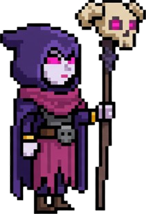

# 🎳 Bowler's Boulders! 🎳

<div align="center">

**A Clash Royale themed endless runner where you dodge boulders and climb to victory!**

[](https://nextjs.org/)
[](https://www.typescriptlang.org/)
[](https://phaser.io/)
[](https://tailwindcss.com/)
[](https://vercel.com/)

</div>

---

## 🎮 What is Bowler's Boulders?

An incredibly addictive endless runner game featuring your favorite Clash Royale characters! Dodge rolling boulders, jump over obstacles, and climb the treacherous mountain slope to reach the top. With **increasingly difficult waves**, smooth animations, satisfying sound effects, and multiple character choices, you'll be running for hours as the challenge ramps up!

<div align="center">

[](https://bowlers-boulders.vercel.app/)

**🎮 Click the image above to play!!**

</div>

---

## 🎮 How to Play

1. **Choose Your Character**: Select from Archer, Valkyrie, or Witch
2. **Start Running**: Use arrow keys or WASD to move forward/backward
3. **Jump Over Boulders**: Press SPACE to jump and avoid rolling boulders
4. **Climb the Slope**: Navigate the curved mountain slope to reach higher waves
5. **Survive the Waves**: Each wave brings **more boulders, faster speeds, and increased difficulty**!
6. **Master the Ramp-Up**: Watch as the challenge intensifies with each passing wave!

### **Controls**
- **⬆️➡️ or W/D**: Move forward (up the slope)
- **⬇️⬅️ or S/A**: Move backward (down the slope)  
- **SPACE**: Jump over boulders
- **Mouse**: Click buttons for navigation

---

## ✨ Features

### 🏃 **Character Collection**
<div align="center">

| Character | Icon | Description | Special Ability |
|-----------|------|-------------|-----------------|
|  **Archer** |  | Swift & Precise | Fast movement and quick jumps |
|  **Witch** |  | Mystical & Agile | Smooth animations and magical feel |
|  **Valkyrie** | ⚔️ | Goon Goddess (soon) | Heavy and powerful (coming soon) |

</div>

### 🎯 **Core Gameplay**
- **Endless Runner**: Infinite waves with **exponentially increasing difficulty**
- **Physics-Based Movement**: Realistic slope climbing and jumping mechanics
- **Boulder Dodging**: Avoid rolling boulders with precise timing
- **Wave Progression**: Each wave brings **more boulders, faster speeds, and tighter timing windows**
- **Ramp-Up Challenge**: Difficulty scales dramatically - can you survive wave 10? 20? 50?
- **Score System**: Track your progress and high scores as you climb the leaderboard

### 🎵 **Audio Experience**
- **Background Music**: *CUSTOM* Atmospheric bowling music on the homepage
- **Sound Effects**: random BBBBBBOWWWWWWLINGGGG sounds
- **Character Sounds**: Unique audio feedback for each character

### 🎨 **Visual Features**
- **Pixel Art Style**: Beautiful pixelated graphics with Clash Royale theme
- **Smooth Animations**: Character idle, walk, squat, and jump animations
- **Dynamic Background**: Animated mountain silhouette with dotted effects
- **Glowing Effects**: Pulsing glow effects on UI elements
- **Responsive Design**: Works perfectly on desktop and mobile

---

## ⚡ Powered By

<div align="center">

**🎮 Built with cutting-edge web technologies for smooth, responsive gameplay**

[](https://phaser.io/)
[](https://nextjs.org/)
[](https://www.typescriptlang.org/)

</div>

**🎯 Game Engine**: **Phaser.js 3.80.1** - The powerful 2D game framework that powers the entire game experience
- **Physics Engine**: Advanced physics simulation for realistic boulder rolling and character movement
- **Scene Management**: Seamless transitions between game states and screens
- **Asset Loading**: Optimized sprite and audio loading with preloading system
- **Input Handling**: Responsive keyboard and mouse controls
- **Animation System**: Smooth character animations and visual effects
- **Collision Detection**: Precise hit detection between boulders and characters

**⚡ Performance**: Built for 60fps gameplay with optimized rendering and memory management

---

## 🚀 Tech Stack

<div align="center">

| Technology | Version | Purpose |
|------------|---------|---------|
|  | 15.5.2 | React framework with App Router |
|  | 5.9.2 | Type-safe development |
|  | 3.80.1 | 2D game engine for browser |
|  | 3.3.6 | Utility-first CSS framework |
|  | 2D | Dynamic background rendering |

</div>

---

## 🛠️ Getting Started

### Prerequisites
- Node.js 18+ 
- npm or yarn

### Installation

1. **Clone the repository**
   ```bash
   git clone https://github.com/yourusername/bowlers-boulders.git
   cd bowlers-boulders
   ```

2. **Install dependencies**
   ```bash
   npm install
   ```

3. **Run the development server**
   ```bash
   npm run dev
   ```

4. **Open your browser** and navigate to [http://localhost:3000](http://localhost:3000)

### Build for Production

```bash
npm run build
npm start
```

---

## 🎯 Game Mechanics

### **Movement System**
- **Slope Physics**: Realistic curved slope with Bezier curve geometry
- **Character Animation**: Idle, walk, squat, and jump animation states
- **Input Handling**: Arrow keys, WASD, and spacebar support
- **Collision Detection**: Precise boulder collision with character

### **Boulder System**
- **Dynamic Spawning**: Boulders spawn at **increasingly frequent intervals**
- **Physics Simulation**: Realistic rolling physics with slope interaction
- **Wave Progression**: **Exponentially more boulders and dramatically faster speeds** each wave
- **Trajectory Calculation**: Boulders follow the curved slope path
- **Difficulty Scaling**: Each wave adds **more boulders, faster spawn rates, and reduced reaction time**

### **UI System**
- **Homepage**: Character selection with animated backgrounds
- **Game HUD**: Wave counter, score display, and instructions
- **Game Over**: Restart, continue, and home buttons
- **Font Loading**: Custom bitmap fonts for authentic arcade feel

---

## 🎨 Game Architecture

### **Scene Management**
- **BootScene**: Initial loading and asset preloading
- **PreloadScene**: Asset loading with font management
- **GameScene**: Main gameplay with physics and collision
- **UIScene**: User interface and game over screens

### **System Components**
- **PlayerController**: Character movement and animation
- **BoulderSpawner**: Boulder generation and physics with **ramping difficulty**
- **BowlerAnimator**: Bowler character animation
- **WaveManager**: **Wave progression and exponential difficulty scaling**
- **ScoreTimer**: Score calculation and timing

### **Asset Management**
- **Sprite Sheets**: Character animations and game objects
- **Audio Files**: Background music and sound effects
- **Font Assets**: Custom bitmap fonts for UI
- **Background Images**: Game backgrounds and UI elements

---

## 🎮 Game Features Deep Dive

### **Character System**
- **Modular Design**: Easy to add new characters
- **Animation States**: Idle, walk, squat, jump for each character
- **Scaling**: Consistent character sizing across all sprites
- **Icon System**: Dedicated character icons for selection

### **Slope Physics**
- **Bezier Curves**: Smooth curved slope geometry
- **Collision Detection**: Precise boulder-slope interaction
- **Character Positioning**: Accurate character placement on slope
- **Visual Mapping**: Slope matches background visual design

### **Audio System**
- **Background Music**: Looping homepage music
- **Sound Effects**: Random game over sounds
- **Browser Compatibility**: Handles autoplay restrictions
- **Volume Control**: Appropriate volume levels

---

## 🤝 Contributing

Contributions are always welcome! Here's how you can help:

1. **Fork the repository**
2. **Create a feature branch**: `git checkout -b feature/amazing-feature`
3. **Commit your changes**: `git commit -m 'Add amazing feature'`
4. **Push to the branch**: `git push origin feature/amazing-feature`
5. **Open a Pull Request`

### **Ideas for Contributions**
- 🎨 New character designs and animations
- 🎵 Additional sound effects and music
- 🏆 Achievement system
- 📱 Mobile touch controls
- ⚡ Performance optimizations
- 🎮 New game modes

---

## 🐛 Known Issues

- **Font Loading**: Custom fonts may not load on first game start
- **Mobile Controls**: Touch controls not yet implemented
- **Audio Autoplay**: Background music requires user interaction
- **High DPI**: Text rendering may appear blurry on some displays

---

## 📄 License

This project is open source and available under the [MIT License](LICENSE).

---

## 👨‍💻 Author

**Swayam Parekh**
- 🐙 github: [github.com/swyxm](https://github.com/swyxm)
- 📧 email: [swayampa@usc.edu](mailto:swayampa@usc.edu)
- 🎓 [Technology and Applied Computing Program](https://tac.usc.edu/) - ai + cs + ba @ usc

---

## 🙏 Acknowledgments

- **Clash Royale** by Supercell for the amazing character designs and theme
- **Phaser.js Team** for the incredible 2D game engine
- **Next.js Team** for the amazing React framework
- **Tailwind CSS** for the utility-first CSS approach
- **Vercel** for seamless deployment

---

<div align="center">

**Made with ❤️ and lots of 🎳**

[](https://github.com/swyxm/bowlers-boulders)
[](https://github.com/swyxm/bowlers-boulders)

*Star ⭐ this repository if you enjoyed the game!*

</div>